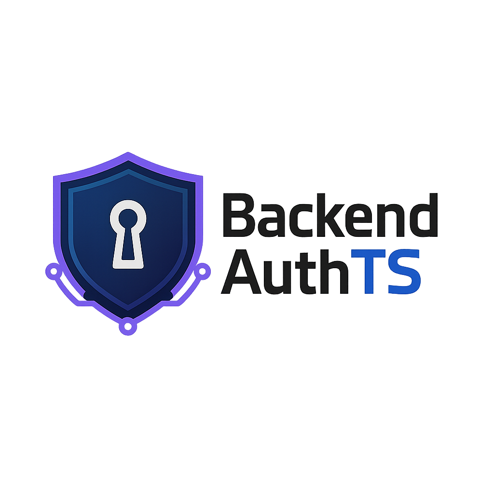

<p align="center">
  
</p>

# Backend Template Auth - TypeScript

<p align="center">Production-ready authentication API for Node.js + TypeScript.</p>

       

Production-ready authentication API using Node.js, Express 5, and TypeScript. It includes user registration, login, logout, JWT-based access tokens, session persistence, and OpenAPI documentation.

## Table of Contents

- [Overview](#overview)
- [Features](#features)
- [Tech Stack](#tech-stack)
- [Prerequisites](#prerequisites)
- [Quick Start](#quick-start)
- [Configuration](#configuration)
  - [Environment Variables](#environment-variables)
  - [Admin User](#admin-user)
  - [CORS](#cors)
- [Prisma Workflow](#prisma-workflow)
  - [Model to Database](#model-to-database)
  - [Database to Model](#database-to-model)
- [API Reference](#api-reference)
  - [Register](#register)
  - [Login](#login)
  - [Logout](#logout)
- [Development Scripts](#development-scripts)
- [Folder Structure](#folder-structure)
- [Notes](#notes)
- [License](#license)
- [Author](#author)

## Overview

This project provides a secure, extensible authentication backend. It uses Prisma for database access and Express 5 for routing. The API exposes endpoints for user registration, login, logout, and serves OpenAPI docs.

## Features

- TypeScript-first Node.js API using `express@5`
- Prisma Client for schema-driven DB access
- Secure password hashing with Argon2
- JWT generation and verification using `jose`
- Session tracking with `jti` and revocation on logout
- Structured logging to console and `logs/` with `winston`
- CORS configuration with open or restricted modes
- Swagger/OpenAPI docs at `/docs` and `/openapi.json`

## Tech Stack

- Runtime: `Node.js`
- Framework: `Express`
- Language: `TypeScript`
- DB: `MySQL` (via `mysql2` + `Prisma`)
- Auth: `jose` (JWT), `argon2`
- Docs: `swagger-jsdoc`, `swagger-ui-express`
- Logging: `winston`, `chalk`

## Prerequisites

- Node.js v18+ installed
- MySQL reachable with credentials defined in `.env`

## Quick Start

1. Clone the repository:
   ```sh
   git clone https://github.com/ElJoamy/backend_template_auth.git
   cd backend_template_auth
   ```
2. Copy the example environment file and edit values:
   ```sh
   cp .env.example .env
   ```
   - Set:
      - App Configuration
      ```env
      # App configuration
      SERVICE_NAME=Backend Template Auth - TypeScript
      VERSION=local
      LOG_LEVEL=DEBUG
      PORT=3000
      ```
      - DB Configuration
      ```env
      # DB configuration
      DB_HOST=localhost
      DB_USER=root
      DB_PASSWORD=root
      DB_PORT=3306
      ```
      - JWT Configuration
      ```env
      # JWT configuration
      JWT_SECRET=changeme
      # In the JWT_SECRET you should use a strong secret key.
      # You can generate a strong secret key using the following command:
      # openssl rand -base64 32
      JWT_ALGORITHM=HS256
      JWT_EXPIRATION_MINUTES=60
      JWT_REFRESH_EXPIRATION_MINUTES=10080
      JWT_ISSUER=http://localhost:3000 
      # this is the url of the Backend 
      # - Desarrollo: http://localhost:3000
      # - Staging: https://api.staging.tu-dominio.com
      # - Producción: https://api.tu-dominio.com
      ```
      - Cors Configuration
      ```env
      # Cors configuration
      ALLOWED_ORIGINS=all
      # To allow origins you could use 
      # "all" to allow all origins
      # "limited" to allow only the ones specified in the list located in src/config/cors_config.ts
      ```
      - Admin User
      ```env
      # Admin user
      SERVICE_USER=admin
      SERVICE_USER_PASS=AdminPassword159@!
      SERVICE_USER_EMAIL=admin@example.com
      ```
   
3. Install dependencies:
   ```sh
   npm install
   ```
4. Run in development:
   ```sh
   npm run dev
   ```
5. Build and run in production:
   ```sh
    npm run build
    npm start
    ```
The server listens on `http://localhost:<PORT>` (default `3000`).

## Configuration

### Environment Variables

- `SERVICE_NAME`: Display name
- `VERSION`: Build/version label shown in docs
- `LOG_LEVEL`: `DEBUG`, `INFO`, `WARN`, `ERROR`
- `PORT`: Server port
- `DB_HOST`, `DB_USER`, `DB_PASSWORD`, `DB_PORT`, `DB_NAME`: MySQL settings used by Prisma
- `DATABASE_URL`: Full connection string for Prisma (recommended). The Prisma schema reads `env("DATABASE_URL")`.
- `JWT_SECRET`: Strong secret; generate with `openssl rand -base64 32`
- `JWT_ALGORITHM`: e.g. `HS256`
- `JWT_EXPIRATION_MINUTES`: Access token TTL
- `JWT_REFRESH_EXPIRATION_MINUTES`: Refresh token TTL
- `JWT_ISSUER`: Token issuer
- `JWT_AUDIENCE`: Token audience
- `ALLOWED_ORIGINS`: `all` or `limited`

### Admin User 

You can create an administrator user from `.env`. On startup the seed is idempotent: it creates the admin only if it does not exist.

- `SERVICE_USER`: Admin username (e.g., `admin`)
- `SERVICE_USER_PASS`: Admin password (e.g., `AdminPassword159@!`)
- `SERVICE_USER_EMAIL`: Admin email (e.g., `admin@example.com`)

Defaults exist in code for development. For production, set these explicitly.

### CORS

Set `ALLOWED_ORIGINS=all` to allow any origin or `limited` to restrict. If `limited`, update the whitelist in `src/config/cors_config.ts`.

## Prisma Workflow

The Prisma schema references `env("DATABASE_URL")`. Credentials should be set in `.env` and never hardcoded in `schema.prisma`.

### Model to Database

- Edit models in `prisma/schema.prisma`
- Apply changes: `npm run prisma:migrate` (or `npm run prisma:push`)
- Regenerate client: `npm run prisma:generate`

### Database to Model

- Introspect: `npm run prisma:pull`
- Regenerate client: `npm run prisma:generate`

## API Reference

Base path: `http://localhost:<PORT>`

### Register

- `POST /api/v1/auth/register`
- Body (JSON or `multipart/form-data`): `name`, `lastname`, `username`, `email`, `password` and optional `phone`
- Success `201`:
  ```json
  {
    "user": {
      "id": 1,
      "name": "John",
      "lastname": "Doe",
      "username": "johndoe",
      "email": "john@example.com",
      "phone": null,
      "role": { "id": 2, "name": "MEMBER" }
    }
  }
  ```

### Login

- `POST /api/v1/auth/login`
- Body: either `{ email, password }` or `{ username, password }`
- Success `200`:
  ```json
  {
    "user_id": 1,
    "role_id": 2,
    "access_token": "<JWT>"
  }
  ```
- Errors: `401` invalid credentials; `409` active session exists

### Logout

- `POST /api/v1/auth/logout`
- Header: `Authorization: Bearer <JWT>`
- Success `200`: `{ "success": true }`

## Development Scripts

- `npm run dev` — Development with hot-reload (runs Prisma helpers before start)
- `npm run build` — Compile TypeScript to `dist/`
- `npm start` — Run compiled server
- Prisma helpers:
  - `npm run prisma:generate` — Generate Prisma Client
  - `npm run prisma:studio` — Open Prisma Studio
  - `npm run prisma:migrate` — Create/apply migrations
  - `npm run prisma:push` — Push schema state
  - `npm run prisma:pull` — Introspect DB
  - `npm run prisma:validate` — Validate schema

## Folder Structure

```
src/
  config/
    cors_config.ts
    db_config.ts
    settings.ts
    swagger.ts
  routes/
    api/
      v1/
        auth/
          login.ts
          logout.ts
          register.ts
        index.ts
  models/
    database/
      user_model.ts
      role_model.ts
      session_model.ts
  services/
    auth/
      login_service.ts
      logout_service.ts
      register_service.ts
  repositories/
    auth/
      common_repository.ts
      login_repository.ts
      register_repository.ts
      session_repository.ts
  utils/
    jwt.ts
    logger.ts
    password_utils.ts
    validators.ts
  index.ts
```

## Notes

- Do not hardcode credentials in `prisma/schema.prisma`. Use `env("DATABASE_URL")`.
- Use strong `JWT_SECRET` and review `JWT_ISSUER`/`JWT_AUDIENCE` for your environment.
- Set `ALLOWED_ORIGINS=limited` for production and update the whitelist.
- Logs are written to `logs/` per file (e.g., `login_service.log`).

## License

This project is licensed under a dual license model.  
See the [LICENSE](LICENSE) file for details.

## Author

<p align="center">
  <a href="https://github.com/ElJoamy">
    
    <br />
    <sub><b>Joseph Meneses (ElJoamy)</b></sub>
  </a>
  <br />
  Backend and AI Developer · Cybersecurity Engineer · DBA
  <br />
  <a href="https://linkedin.com/in/joamy5902">
    
  </a>
  <a href="https://github.com/ElJoamy">
    
  </a>
</p>
